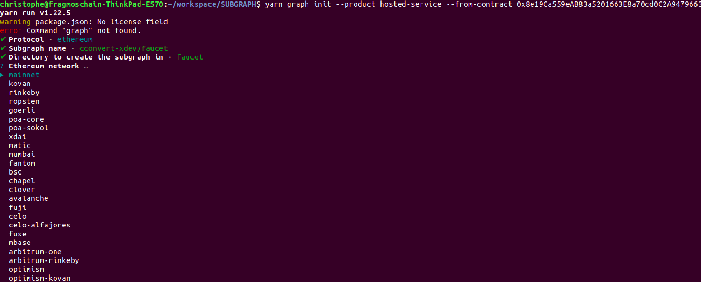
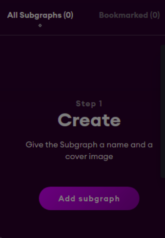
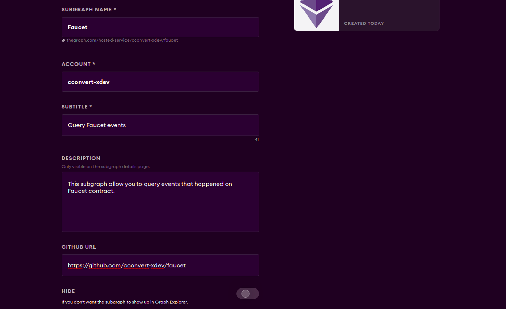
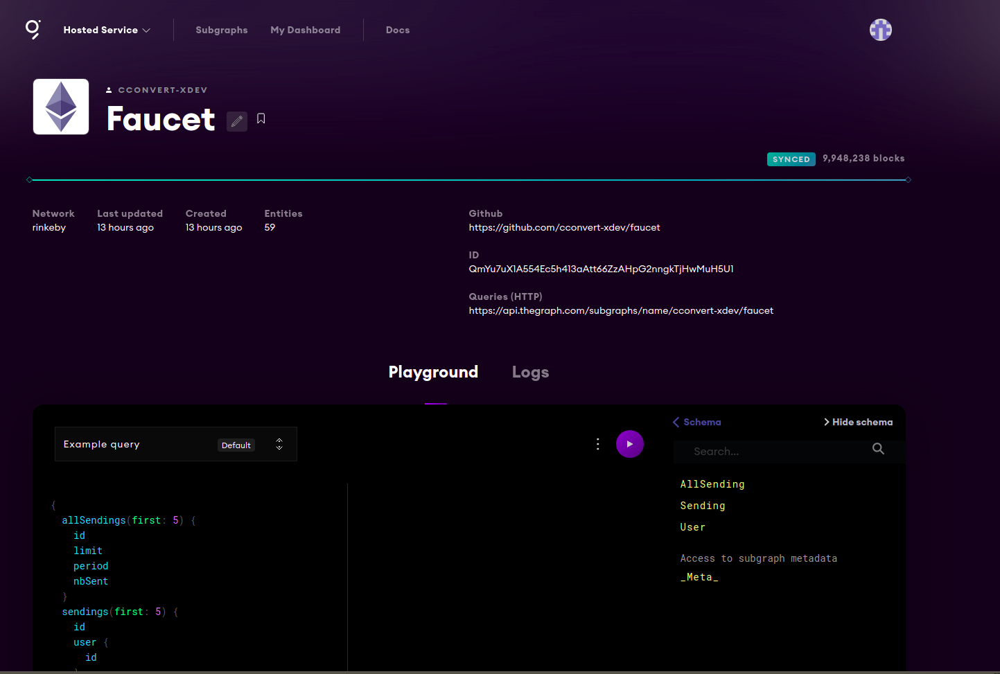

## 1 What is The graph

For an NFT or gaming application, we can find directly the owner of a NFT or an item based on their ID.  
For doing this, we only have to request a read operation on the contract.  
But more advanced queries like finding all NFT or items associated to a user is not possible only by querying the read method's on contract.  
For doing this we would have to process every transfer event emmitted, agregate data and process.
This is not possible for a dapp only running on a browser.  
With a server thinks are not much better, because this require a centralized cache to store data and thus it introduce a security weakness.  
That is why The Graph network was created.

The graph is an opensource software based on a decentralized protocol that work as a cache  
for indexing and querying data from blockchain.  
It was initially created for ethereum blockchain and then started to integrate other blockchain. 
Were as a classic database, on blockchains you cannot perform a query on data by criteria.

The Graph retrieves blocks and extract data before storing it into indexed tables, called Subgraphs, allowing any application  
to perform a query to its protocol and receive the response.  

The Graph comes with its own crypto currency called GRT.

its protocol include 3 types of actors:

Curators: They are subgraph developers who assess which subgraphs need to be indexed by The Graph.  
They needs to attach GRT to these subgraphs.    

Indexers: Node operators tasked with providing indexing and querying services for the signaled subgraphs,  
and must stake GRT in order to provide these services.  

Delegators: Delegate GRT to indexers in order to contribute to running the network without installing a node.  

## 2 Install the Graph 
The Graph CLI is written in JavaScript and you will need to have either npm or yarn installed to use it.

# NPM
$ npm install -g @graphprotocol/graph-cli

# Yarn
$ yarn global add @graphprotocol/graph-cli

## 3 Creating a subgraph

For creating a subgraph, you have 2 options.  
If it is on mainnet you can create it using The Graph studio.  

For testnets other environnements (and mainnet) we must use hosted service.  
This is the option we are going to take in this tutorial.  

When creating our subgraph, we can either create it from an example and then customize it:  

```shell
graph init --product hosted-service --from-example
```

Or we can create it from a contract.
In this example we will create it from the faucet contract (at 0x8e19Ca559eAB83a5201663E8a70cd0C2A9479663) on the Rinkeby network:  

```shell
yarn graph init --product hosted-service --from-contract 0x8e19Ca559eAB83a5201663E8a70cd0C2A9479663
```

### 3.1 setting subgraph name

You will be asked to provide a subgraph name.
The require format is 

```shell
<GITHUB_NAME>/<GITHUB_REPOSITORY>
```


```shell
<GITHUB_REPOSITORY>
```
Is the name of the repository associated with your project. Be aware that it will only create the repository locally.

### 3.2 setting project folder name  

Just choose a folder name for the project associated with your subgraph


### 3.3 setting subgraph network  

First we will deploy our subgraph on Rinkeby to test it.  



### 3.3 confirm contract address  

And we confirm the contract address


### 3.4 contract name  

You will be ask to choose a contract name for ts object that will bind your ethereum contract.  
You can keep the same name.  


### 3.5 contract name  

Project generation of your subgraph is now finished.  


Open your folder on visual studio and look at files.

## 3 Subgraph manifest file  

Open the subgraph.yaml file at the root of your project.  
You should know see something like this.  

```yaml
specVersion: 0.0.2
schema:
  file: ./schema.graphql
dataSources:
  - kind: ethereum
    name: Faucet
    network: rinkeby
    source:
      address: "0x8e19Ca559eAB83a5201663E8a70cd0C2A9479663"
      abi: Faucet
    mapping:
      kind: ethereum/events
      apiVersion: 0.0.5
      language: wasm/assemblyscript
      entities:
        - FaucetLimit
        - FaucetPeriod
        - FaucetRetrieved
        - FaucetSent
        - OwnershipTransferred
      abis:
        - name: Faucet
          file: ./abis/Faucet.json
      eventHandlers:
        - event: FaucetLimit(uint256)
          handler: handleFaucetLimit
        - event: FaucetPeriod(uint256)
          handler: handleFaucetPeriod
        - event: FaucetRetrieved(address,uint256)
          handler: handleFaucetRetrieved
        - event: FaucetSent(address,uint256)
          handler: handleFaucetSent
        - event: OwnershipTransferred(indexed address,indexed address)
          handler: handleOwnershipTransferred
      file: ./src/mapping.ts
```
If you want a full description of all fields you can look at 
[subgraph.yaml description](https://github.com/graphprotocol/graph-node/blob/master/docs/subgraph-manifest.md)  

The first part of the datasource define informations about the type of blockchain, its network and the contract from which the subgraph was generated.  

```yaml
dataSources:
  - kind: ethereum
    name: Faucet
    network: rinkeby
    source:
      address: "0x8e19Ca559eAB83a5201663E8a70cd0C2A9479663"
      abi: Faucet
```

The other part of the file tells us that our subgraph will behave like a handler processing every type of event from our contract by calling
callback methods on it.  
Here are the ts event associated to solidity contract event.

```yaml
      entities:
        - FaucetLimit
        - FaucetPeriod
        - FaucetRetrieved
        - FaucetSent
        - OwnershipTransferred
```

And here are the handlers:  

```yaml
      eventHandlers:
        - event: FaucetLimit(uint256)
          handler: handleFaucetLimit
        - event: FaucetPeriod(uint256)
          handler: handleFaucetPeriod
        - event: FaucetRetrieved(address,uint256)
          handler: handleFaucetRetrieved
        - event: FaucetSent(address,uint256)
          handler: handleFaucetSent
        - event: OwnershipTransferred(indexed address,indexed address)
          handler: handleOwnershipTransferred
      file: ./src/mapping.ts
```

## 4 code generation

Next step is to generate the code that will make the binding with both the contract an events on it with:

```shell
graph codegen
```

The Graph generate you a mapping.ts file in src folder that contains empty handler to process event

```ts
import {
  Faucet,
  FaucetLimit,
  FaucetPeriod,
  FaucetRetrieved,
  FaucetSent,
  OwnershipTransferred,
} from "../generated/Faucet/Faucet";

export function handleFaucetSent(event: FaucetSent): void {}

export function handleFaucetLimit(event: FaucetLimit): void {}

export function handleFaucetPeriod(event: FaucetPeriod): void {}

export function handleFaucetRetrieved(event: FaucetRetrieved): void {}

export function handleOwnershipTransferred(event: OwnershipTransferred): void {}
```

we can rename it faucet.ts. Don't forget to do this in subgraph.yaml  

## 5 Define your entities 

You should now define your entities in your schema.graphql  


Your entities are your database model. You will use it to store your data and to query it.
Before defining your entities you must think of the structure of your data as you will do for a classic database model.
-Type
-constraints
-References and ids
Reference documentation for GraphQL schemas can be found in the GraphQL API section.
[schema.graphql entities](https://thegraph.com/docs/en/developer/create-subgraph-hosted/#defining-entities)  

With The Graph, you simply define entity types in schema.graphql, and Graph Node will generate top level fields for querying single instances and collections of that entity type. Each type that should be an entity is required to be annotated with an @entity directive.

Every entity is declared with an @entity directive.
In our example we will define entities:

```
type AllSending @entity {
  id: ID! # "all"
  limit: BigInt!
  period: BigInt!
  nbSent: BigInt!
  totalSent: BigInt!
  last: BigInt!
}

type Sending @entity {
  id: ID!
  user: User!
  amount: BigInt!
  timestamp: BigInt!
}

type User @entity {
  id: ID! # address
  totalReceived: BigInt!
  timestamp: BigInt!
}

```

Available type are:
    
|Type	 | Description |
|------|:-----------:|
|Bytes | Byte array, represented as a hexadecimal string. Commonly used for Ethereum hashes and addresses.|
|ID	   | Stored as a string.
|String |	Scalar for string values. Null characters are not supported and are automatically removed.|
|Boolean |	Scalar for boolean values. |
|Int	| The GraphQL spec defines Int to have size of 32 bytes. |
|BigInt |	Large integers. Used for Ethereum's uint32, int64, uint64, ..., uint256 types. Note: Everything below uint32, such as int32, uint24 or int8 is represented as i32. |
|BigDecimal |	BigDecimal High precision decimals represented as a signficand and an exponent. The exponent range is from −6143 to +6144. Rounded to 34 significant digits. |

A ```!``` after a type means the field cannot be null.

## 6 Generate typescript binded entities 

Once done do a code generation. 

```shell
graph codegen
```

This will generate typescript binded entities to previously defined entites in the file schema.ts  

```ts
import {
  TypedMap,
  Entity,
  Value,
  ValueKind,
  store,
  Bytes,
  BigInt,
  BigDecimal
} from "@graphprotocol/graph-ts";

export class AllSending extends Entity {
  constructor(id: string) {
    super();
    this.set("id", Value.fromString(id));

    this.set("limit", Value.fromBigInt(BigInt.zero()));
    this.set("period", Value.fromBigInt(BigInt.zero()));
    this.set("nbSent", Value.fromBigInt(BigInt.zero()));
    this.set("totalSent", Value.fromBigInt(BigInt.zero()));
    this.set("last", Value.fromBigInt(BigInt.zero()));
  }

  save(): void {
    let id = this.get("id");
    assert(id != null, "Cannot save AllSending entity without an ID");
    if (id) {
      assert(
        id.kind == ValueKind.STRING,
        "Cannot save AllSending entity with non-string ID. " +
          'Considering using .toHex() to convert the "id" to a string.'
      );
      store.set("AllSending", id.toString(), this);
    }
  }

  static load(id: string): AllSending | null {
    return changetype<AllSending | null>(store.get("AllSending", id));
  }

  get id(): string {
    let value = this.get("id");
    return value!.toString();
  }

  set id(value: string) {
    this.set("id", Value.fromString(value));
  }

  get limit(): BigInt {
    let value = this.get("limit");
    return value!.toBigInt();
  }

  set limit(value: BigInt) {
    this.set("limit", Value.fromBigInt(value));
  }

  get period(): BigInt {
    let value = this.get("period");
    return value!.toBigInt();
  }

  set period(value: BigInt) {
    this.set("period", Value.fromBigInt(value));
  }

  get nbSent(): BigInt {
    let value = this.get("nbSent");
    return value!.toBigInt();
  }

  set nbSent(value: BigInt) {
    this.set("nbSent", Value.fromBigInt(value));
  }

  get totalSent(): BigInt {
    let value = this.get("totalSent");
    return value!.toBigInt();
  }

  set totalSent(value: BigInt) {
    this.set("totalSent", Value.fromBigInt(value));
  }

  get last(): BigInt {
    let value = this.get("last");
    return value!.toBigInt();
  }

  set last(value: BigInt) {
    this.set("last", Value.fromBigInt(value));
  }
}

export class Sending extends Entity {
  constructor(id: string) {
    super();
    this.set("id", Value.fromString(id));

    this.set("user", Value.fromString(""));
    this.set("amount", Value.fromBigInt(BigInt.zero()));
    this.set("timestamp", Value.fromBigInt(BigInt.zero()));
  }

  save(): void {
    let id = this.get("id");
    assert(id != null, "Cannot save Sending entity without an ID");
    if (id) {
      assert(
        id.kind == ValueKind.STRING,
        "Cannot save Sending entity with non-string ID. " +
          'Considering using .toHex() to convert the "id" to a string.'
      );
      store.set("Sending", id.toString(), this);
    }
  }

  static load(id: string): Sending | null {
    return changetype<Sending | null>(store.get("Sending", id));
  }

  get id(): string {
    let value = this.get("id");
    return value!.toString();
  }

  set id(value: string) {
    this.set("id", Value.fromString(value));
  }

  get user(): string {
    let value = this.get("user");
    return value!.toString();
  }

  set user(value: string) {
    this.set("user", Value.fromString(value));
  }

  get amount(): BigInt {
    let value = this.get("amount");
    return value!.toBigInt();
  }

  set amount(value: BigInt) {
    this.set("amount", Value.fromBigInt(value));
  }

  get timestamp(): BigInt {
    let value = this.get("timestamp");
    return value!.toBigInt();
  }

  set timestamp(value: BigInt) {
    this.set("timestamp", Value.fromBigInt(value));
  }
}

export class User extends Entity {
  constructor(id: string) {
    super();
    this.set("id", Value.fromString(id));

    this.set("totalReceived", Value.fromBigInt(BigInt.zero()));
    this.set("timestamp", Value.fromBigInt(BigInt.zero()));
  }

  save(): void {
    let id = this.get("id");
    assert(id != null, "Cannot save User entity without an ID");
    if (id) {
      assert(
        id.kind == ValueKind.STRING,
        "Cannot save User entity with non-string ID. " +
          'Considering using .toHex() to convert the "id" to a string.'
      );
      store.set("User", id.toString(), this);
    }
  }

  static load(id: string): User | null {
    return changetype<User | null>(store.get("User", id));
  }

  get id(): string {
    let value = this.get("id");
    return value!.toString();
  }

  set id(value: string) {
    this.set("id", Value.fromString(value));
  }

  get totalReceived(): BigInt {
    let value = this.get("totalReceived");
    return value!.toBigInt();
  }

  set totalReceived(value: BigInt) {
    this.set("totalReceived", Value.fromBigInt(value));
  }

  get timestamp(): BigInt {
    let value = this.get("timestamp");
    return value!.toBigInt();
  }

  set timestamp(value: BigInt) {
    this.set("timestamp", Value.fromBigInt(value));
  }
}

```
## 7 Write events handlers

Once we have our binded entites in typescript, we can use it write our handler that will process events, create entities and save them.  
Here is an example with our Faucet contract. We proceed send event. We then fill and save our entities.

```ts
import { BigInt } from "@graphprotocol/graph-ts";
import {
  Faucet,
  FaucetLimit,
  FaucetPeriod,
  FaucetRetrieved,
  FaucetSent,
  OwnershipTransferred,
} from "../generated/Faucet/Faucet";
import { AllSending, Sending, User } from "../generated/schema";

// import { log } from "@graphprotocol/graph-ts";

let ADDRESS_ZERO = "0x0000000000000000000000000000000000000000";

let ONE = BigInt.fromI32(1);
let ZERO = BigInt.fromI32(0);

export function handleFaucetSent(event: FaucetSent): void {
  let receiver = event.params._receiver.toHex();
  let amountSent = event.params._amountSent;
  // We have access to transaction through event
  let transactionHash = event.transaction.hash.toHex();
  // It is possible to access smart contracts from mappings. For
  // example, the contract that has emitted the event can be connected to
  // with:
  let contract = Faucet.bind(event.address);

  // Entities can be loaded from the store using a string ID; this ID
  // needs to be unique across all entities of the same type
  let all = AllSending.load("all");

  // If it does not exist we create entity
  if (all == null) {
    all = new AllSending("all");
    all.nbSent = ZERO;
    all.totalSent = ZERO;
    all.limit = ZERO;
    all.period = ZERO;
  }
  all.nbSent = all.nbSent.plus(ONE);
  all.totalSent = all.totalSent.plus(amountSent);
  // The following functions can then be called on this contract to access
  // state variables and other data:
  all.limit = contract.getLimit();
  all.period = contract.getPeriod();
  all.last = event.block.timestamp;

  if (receiver !== ADDRESS_ZERO) {
    let user = User.load(receiver);
    if (user == null) {
      user = new User(receiver);
      user.totalReceived = ZERO;
      user.timestamp = ZERO;
    }
    user.totalReceived.plus(amountSent);
    if (user.timestamp.lt(event.block.timestamp)) {
      user.timestamp = event.block.timestamp;
    }

    let sending = Sending.load(transactionHash);
    if (sending == null) {
      sending = new Sending(transactionHash);
      sending.user = user.id;
      sending.amount = ZERO;
      sending.timestamp = ZERO;
    }
    sending.amount = amountSent;
    // Entity fields can be set based on event parameters
    sending.timestamp = event.block.timestamp;

    // Entities can be written to the store with `.save()`
    user.save();
    sending.save();
  }

  // Entities can be written to the store with `.save()`
  all.save();
}

export function handleFaucetLimit(event: FaucetLimit): void {}

export function handleFaucetPeriod(event: FaucetPeriod): void {}

export function handleFaucetRetrieved(event: FaucetRetrieved): void {}

export function handleOwnershipTransferred(event: OwnershipTransferred): void {}
```

## 8 Build & deploy

### 8.1 Build

For building the subgraph, run the command.

```shell
graph build
```

This will generate artifact it build sub folder.  
You will find a Faucet.wasm file and a Faucet.json file.  

### 8.2 Subgraph creation on dashbord

First you must go on your Dashbord and create your subgraph on it.



Set all required fields and click on create.



### 8.2 Deployment

For Authentification and then deployment, you will need an Access Token. You can find it on your dashbord.  


then run command lines

```shell
graph auth --product hosted-service <ACCESS_TOKEN>

deploy --product hosted-service cconvert-xdev/faucet
```
## 9 Use your subgraph for querying objects

Your subgraph is now deployed.  
You can access and query it at:

[schema.graphql entities](https://api.thegraph.com/subgraphs/name/cconvert-xdev/faucet)  



notice that you are given an api link:

```url
https://api.thegraph.com/subgraphs/name/cconvert-xdev/faucet
```

This is the api you can use for querying your subgraph from your dapp.  
For example with urql lib you can do:

first install it:

```shell
npm install urql graphql

or 

yarn install urql graphql

```
and then on your dapp you can query your subgraph with:

```ts
import { createClient } from 'urql';

const APIURL = "https://api.thegraph.com/subgraphs/name/cconvert-xdev/faucet";

const query = `
  query {
    sendings(first: 5) {
      id
      user {
        id
      }
      amount
      timestamp
    }
  }
`;

const client = createClient({
  url : APIURL
});

const data = await client.query(query).toPromise();
```

This will provide you a Promise with the result of your queries.  

you can also do it with Apollo client:

```shell
npm install @apollo/client graphql

or 

yarn install @apollo/client graphql
```

```ts
import { ApolloClient, InMemoryCache, gql } from '@apollo/client'

const APIURL = 'https://api.studio.thegraph.com/query/cconvert-xdev/faucet';

const query = `
  query {
    sendings($first: Int) {
      id
      user {
        id
      }
      amount
      timestamp
    }
  }
`;

const client = new ApolloClient({
  uri: APIURL,
  cache: new InMemoryCache(),
});

client
  .query({
    query: gql(query),
    variables: {
      first: 5
    },
  })
  .then((data) => console.log('Subgraph data: ', data))
  .catch((err) => {
    console.log('Error fetching data: ', err)
  });
```

## 10 Write queries

you will find a detailed description of graphQl api [here](https://thegraph.com/docs/en/developer/graphql-api/) 

### 10.1 Write queries

Once your subgraph is deployed you can run query on web console:
go to the [Faucet console](https://thegraph.com/hosted-service/subgraph/cconvert-xdev/faucet)  

Queries are written in GraphQl.  
GraphQL is a query language for fulfilling queries with data.  
So your query will be a json like structure that matches your data structure defined on subgraphql.  

For example if you want to retrieve all sending events, you can run the query:


```graphql
{
  sendings {
    id
    user {
      id
    }
    amount
    timestamp
  }
}

```

with the result:

```json
{
  "data": {
    "sendings": [
      {
        "amount": "2000000000000000000000",
        "id": "0x02bb8a8f5de1c881b387281b411c6348ff21a24397ed954a00c1d5f51eb6bb7e",
        "timestamp": "1638056095",
        "user": {
          "id": "0xc505f9cabf8d98adc793108d70cdb62dc9738b46"
        }
      },

      ...

      {
        "amount": "2000000000000000000000",
        "id": "0xff60fb46ed340e46d662bc16090bc9e44e41c92bc27f213a979d52e1a6ff0cdd",
        "timestamp": "1636131700",
        "user": {
          "id": "0x8a0e83de499d7543cf486974a6196a35b5f573e7"
        }
      }
    ]
  }
}
```

You can also retrieve multiple entities at the time: 

```graphql
{
  allSendings {
    id
    limit
    period
    nbSent
  }
  sendings {
    id
    user {
      id
    }
    amount
    timestamp
  }
}

```


```json
{
  "data": {
    "allSendings": [
      {
        "id": "all",
        "limit": "2000000000000000000000",
        "nbSent": "48",
        "period": "180"
      }
    ],
    "sendings": [
      {
        "amount": "2000000000000000000000",
        "id": "0x02bb8a8f5de1c881b387281b411c6348ff21a24397ed954a00c1d5f51eb6bb7e",
        "timestamp": "1638056095",
        "user": {
          "id": "0xc505f9cabf8d98adc793108d70cdb62dc9738b46"
        }
      },
      
      ...

      {
        "amount": "2000000000000000000000",
        "id": "0xff60fb46ed340e46d662bc16090bc9e44e41c92bc27f213a979d52e1a6ff0cdd",
        "timestamp": "1636131700",
        "user": {
          "id": "0x8a0e83de499d7543cf486974a6196a35b5f573e7"
        }
      }
    ]
  }
}
```

### 10.2 Sorting data

Like commons database query langages there are sorting features:


```graphql
{
  sendings(orderBy: timestamp, orderDirection: desc) {
    id
    user {
      id
    }
    amount
    timestamp
  }
}

```

This query will return Sending events sorted by timestamp field in descending order.
Use asc for ascending order.

```json

{
  "data": {
    "sendings": [
      {
        "amount": "2000000000000000000000",
        "id": "0x8c31a1b639a1632820c99ede166d2f62819d96ae6780c2a6f5dc3c011755cfbd",
        "timestamp": "1641807454",
        "user": {
          "id": "0xf0de2e2a55a1f8735fde0a2f5ef1e47250c39e72"
        }
      },
      {
        "amount": "2000000000000000000000",
        "id": "0x8da77da254457b69329042ae077eb50b516b65b96b00b86a4bd8291302a6cea7",
        "timestamp": "1641215535",
        "user": {
          "id": "0x45f2c1f9d0be8e0ef2b3fe65699404159b3a804b"
        }
      },

      ...

      {
        "amount": "999000000000",
        "id": "0x6ad605a75baec49827cab050dcb70631948ec324d5313bfa198d287f69e51b1d",
        "timestamp": "1635954952",
        "user": {
          "id": "0x8a0e83de499d7543cf486974a6196a35b5f573e7"
        }
      }
    ]
  }
}

```

### 10.2 Pagination

You can perform pagination on data using ```first``` and ```skip``` key words.
```skip 2``` means you want to skip the 2 first entities returned by the query.
```first 5``` means you want to keep only 5 entities after the skipped entities returned by the query.


```graphql
{
  sendings(first: 5, skip: 2, orderBy: timestamp, orderDirection: desc) {
    id
    user {
      id
    }
    amount
    timestamp
  }
}

```
This feature is usefull when you want to retrieve your data into buckets.


### 10.3 Filtering

For performing a filter on your queries,  
You can use  ```where``` keyword.  
The syntax for expressing a condition is <Field Name><suffix> : <value>  

for example the first 5 event with timestamp greatter or equal than 1641215535  
are given by the query.  

```graphql
{
  sendings(first: 5, where: { timestamp_gte: 1641215535 }) {
    id
    user {
      id
    }
    amount
    timestamp
  }
}

```

Available suffix are:

```
_not
_gt
_lt
_gte
_lte
_in
_not_in
_contains
_not_contains
_starts_with
_ends_with
_not_starts_with
_not_ends_with
```


